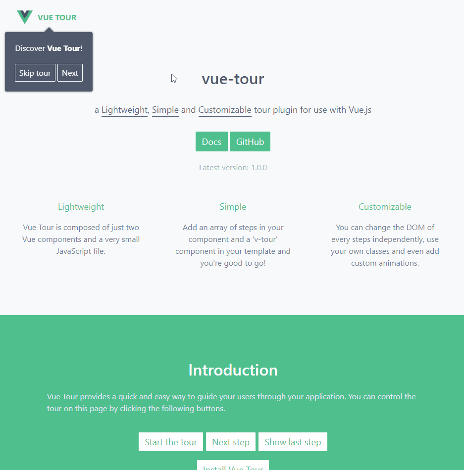

# Vue Tour

[](https://circleci.com/gh/pulsardev/vue-tour/tree/master)

> Vue Tour is a lightweight, simple and customizable tour plugin for use with Vue.js.
> It provides a quick and easy way to guide your users through your application.

[](https://pulsardev.github.io/vue-tour/)

## Table of Contents

- [Getting Started](#getting-started)
- [Something Missing?](#something-missing)

## Getting Started

You can install `vue-tour` using npm or by downloading the minified build on GitHub.

```
npm install vue-tour
```

Then import the plugin in your application entry point (typically main.js if you used vue-cli to scaffold your project) and tell Vue to use it.
Also don't forget to include the styles. You can add the styles provided by default or customize them to your own liking.

```javascript
import Vue from 'vue'
import App from './App.vue'
import VueTour from 'vue-tour'

require('vue-tour/dist/vue-tour.css')

Vue.use(VueTour)

new Vue({
  render: h => h(App)
}).$mount('#app')
```

Finally put a `v-tour` component in your template anywhere in your app (usually in App.vue) and pass it an array of steps.
The `target` property of each step can target a DOM element in any component of your app (as long as it exists in the DOM when the concerned step pops up).

```html
<template>
  <div>
    <div id="v-step-0">A DOM element on your page. The first step will pop on this element because its ID is 'v-step-0'.</div>
    <div class="v-step-1">A DOM element on your page. The second step will pop on this element because its ID is 'v-step-1'.</div>
    <div data-v-step="2">A DOM element on your page. The third and final step will pop on this element because its ID is 'v-step-2'.</div>

    <v-tour name="myTour" :steps="steps"></v-tour>
  </div>
</template>

<script>
  export default {
    name: 'my-tour',
    data () {
      return {
        steps: [
          {
            target: '#v-step-0',  // We're using document.querySelector() under the hood
            content: `Discover <strong>Vue Tour</strong>!`
          },
          {
            target: '.v-step-1',
            content: 'An awesome plugin made with Vue.js!'
          },
          {
            target: '[data-v-step="2"]',
            content: 'Try it, you\'ll love it!<br>You can put HTML in the steps and completely customize the DOM to suit your needs.',
            params: {
              placement: 'top'
            }
          }
        ]
      }
    },
    mounted: function () {
      this.$tours['myTour'].start()
    }
  }
</script>
```

For all individual elements you want to add a step on, make sure it can be retrieved with `document.querySelector()`. You can use any selector, an ID, a CSS class, data attributes, etc.
Once this is done and your steps correctly target some DOM elements of your application, you can start the tour by calling the following method.

```javascript
this.$tours['myTour'].start()
```

For a more detailed documentation, checkout the [docs for vue-tour](https://pulsar.gitbooks.io/vue-tour/).

## Something Missing?

If you have a feature request or found a bug, [let us know](https://github.com/pulsardev/vue-tour/issues) by submitting an issue.
